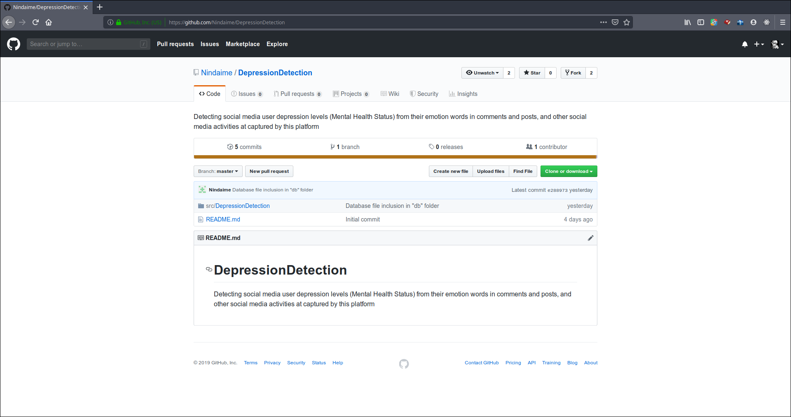

#   DepressionDetection
Detecting social media user depression levels (Mental Health Status) from their emotion words in comments and posts, and other social media activities at captured by this platform.

##  Introduction

These steps can be followed to contribute to this project.

This repository contains the files related to this software. The `master` branch contains the app's source code (the code the app's developers edit), and the `src/DepressionDetection` contains various modules required for the development of the Depression Detection System.


##  Prerequisites

1.  This system is being built using the Java JDK Version 8. Here's the adequate version i use:

```
$ java --version
java version "1.8.0_201"
Java(TM) SE Runtime Environment (build 1.8.0_201-b09)
Java HotSpot(TM) 64-Bit Server VM (build 25.201-b09, mixed mode)
```
Use this link to download and install [`Java JDK Version 8`](https://www.oracle.com/technetwork/java/javase/downloads/jdk8-downloads-2133151.html)

2. (Optional) Git command line stupid content tracker:

```
$  git --version
git version 2.17.1
```
Use this link to download and install [`Git`](https://git-scm.com/book/en/v2/Getting-Started-Installing-Git)

3.  Although not compulsory, you can decide to fork the repository using the Github webpage interface.



Alternatively you can clone this repository:
```
$   clone https://github.com/Nindaime/DepressionDetection.git
Cloning into 'DepressionDetection'...
remote: Enumerating objects: 62, done.
remote: Counting objects: 100% (62/62), done.
remote: Compressing objects: 100% (32/32), done.
remote: Total 62 (delta 27), reused 59 (delta 27), pack-reused 0
Unpacking objects: 100% (62/62), done.
```

3.  Make PRs and contribute and push.

#   References

1.  [`Contributing to a  project`](https://git-scm.com/book/en/v2/Distributed-Git-Contributing-to-a-Project)
2.  [`Making first contribution`](https://github.com/JOMADI/first-contributions)
